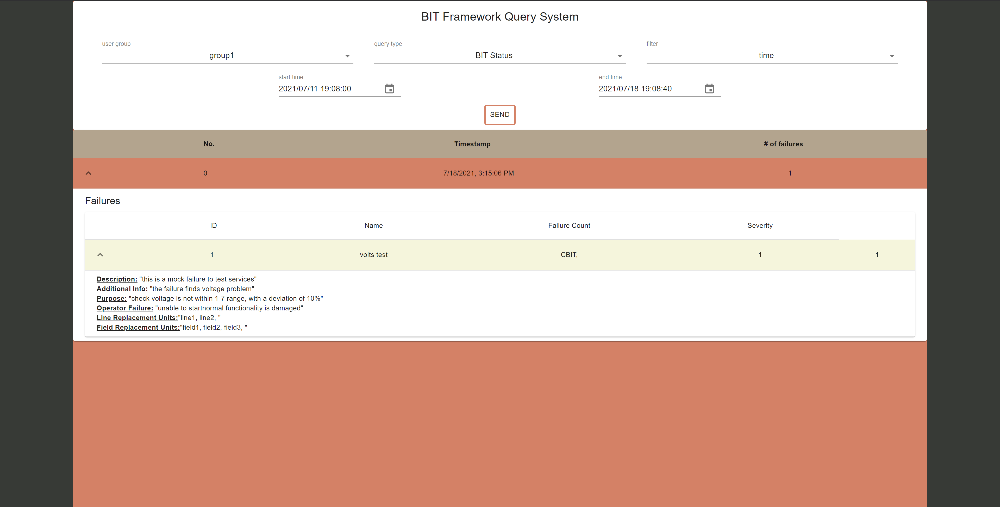

# BIT framework

## Description

BIT framework is a cross-platform microservices based predictive maintenance framework which aims to enable collection of test reports from a wide range of client endpoints.
Our goal was to build each service as simple and independent as we can. Each service has it's own purpose but may rely on other services.

The main goal of the system is to collect reports, analyze them and produce a "BIT status report" that reflects potential failures and vulnerabilities of the reporting clients.

## Installation and Usage
Assuming "go" is installed on the machine and the environment variables `$GOPATH`, `$GOROOT` is set properly (happens part of the default installation of golang) we can fetch a service's modules and dependencies, build and run it in a simple go instruction.

To install a service, From the machine shell (or cmd prompt in Windows) use the command:
```
> go install github.com/edendoron/bit-framework/cmd/<service-name>@v1.0.3
```
after the `@` write the specific version you want to install. Currently, the latest version is v1.0.3, you can also write `@latest`

The `go install` command will automatically compile the program in your current directory. The command will include all your `*.go` files in the directory. It will also build all of the supporting code needed to be able to execute the binary on any computer with the same system architecture, regardless of whether that system has the `.go` source files, or even a Go installation. The executable is placed into the `$GOPATH/bin` directory.

Then, to run it, change your working directory to the project path inside GOPATH
(`$GOPATH/pkg/github.com/edendoron/bit-framework`) and run the following command:

```
> go run ./cmd/<service-name> -config-file ./configs/prog_configs/configs.yml
```

Or use our simple script for linux:
```
> ./scripts/run_<service-name>.sh
```
And for windows:
```
> scripts\run_<service-name>.cmd
```
To run all services together (one by one) you can use `run_all` script.

For linux:
```
> ./scripts/run_all.sh
```
And for windows:
```
> scripts\run_all.cmd
```

* We will explain about the -config-file flag later.

Now you can use the 'BIT test results exporter' service in order to ingest test reports in to the system, and see the analytics results using the UI or any client request from the 'BIT query service'.
### Usage example

Let's test the installation and see the flow of data between microservices.

After running the `run_all` script, or the 'Storage' service, and the 'Config' service, One of the configuration failures (testID No. 1) is stored in the local file system.
You can find the failure definition under `./configs/config_failures/voltage_failure.json`.

* We will elaborate on failure definition later.

This failure goal is to find voltage reports that the reported value is out of the range 1-7 with 10% deviation allowed. Because of the 'Handler' default configurations, it is currently searching for this failure every second. Now we can add test reports to the storage using the 'Exporter' service.

We'll use an example ReportBody located in the repository under `./usageExample/reports`:
```
{
  "reports": [
    {
      "testId": 1,
      "reportPriority": 10,
      "timestamp": "2021-05-15T11:28:29.7987531+03:00",
      "tagSet": [
        {
          "key": "versions",
          "value": "external clients"
        }
      ],
      "fieldSet": [
        {
          "key": "ICD-1",
          "value": "1.2.3.4-rc5678"
        },
        {
          "key": "ICD-2",
          "value": "3.2.3.4-rc5678"
        },
        {
          "key": "ICD-3",
          "value": "3.2.3.4-rc5678"
        }
      ]
    },
    {
      "testId": 2,
      "reportPriority": 200,
      "timestamp": "2021-07-18T13:50:10.5+03:00",
      "tagSet": [
        {
          "key": "zone",
          "value": "north"
        },
        {
          "key": "hostname",
          "value": "server02"
        }
      ],
      "fieldSet": [
        {
          "key": "TemperatureCelsius",
          "value": "-40.8"
        },
        {
          "key": "volts",
          "value": "12"
        }
      ]
    }
  ]
}
```
As you can see, test report 2 is violating our failure examination rule, and so should be reported in a BIT status report.
In order to demonstrate the 'BIT handler' work logic, we need to change the report's timestamp. Note that the 'Handler' does not examine reports retrospectively, so we'll change the date to be in about a minute from the system's current time (this is due to the fact that in real-time systems reports are being reported and extracted from the storage in a matter of milliseconds and so in order to make sure this report isn't ignored by the 'Handler' we give it a future timestamp).

You can use 'Postman' or 'curl' a command-line tool for transferring data, and send this report through the exporter. Here is an example of how to use 'curl' (bash syntax):
```
curl --location --request POST 'localhost:8087/report/raw' \
--header 'Content-Type: application/json' \
--data-raw '{
  "reports": [
    {
      "testId": 1,
      "reportPriority": 10,
      "timestamp": "2021-05-15T11:28:29.7987531+03:00",
      "tagSet": [
        {
          "key": "versions",
          "value": "external clients"
        }
      ],
      "fieldSet": [
        {
          "key": "ICD-1",
          "value": "1.2.3.4-rc5678"
        },
        {
          "key": "ICD-2",
          "value": "3.2.3.4-rc5678"
        },
        {
          "key": "ICD-3",
          "value": "3.2.3.4-rc5678"
        }
      ]
    },
    {
      "testId": 2,
      "reportPriority": 200,
      "timestamp": "2021-07-18T13:50:10.5+03:00",
      "tagSet": [
        {
          "key": "zone",
          "value": "north"
        },
        {
          "key": "hostname",
          "value": "server02"
        }
      ],
      "fieldSet": [
        {
          "key": "TemperatureCelsius",
          "value": "-40.8"
        },
        {
          "key": "volts",
          "value": "12"
        }
      ]
    }
  ]
}'
```

When the current time matches the provided timestamp, the 'Handler' will identify the failure and will post it in the upcoming 'BIT status report'.

You can run the client (explained in the corresponding web-UI service section) in order to experience the BIT status report (or address the 'Query' service directly).
Here is an example screenshot of how this data will appear in the Web-UI:



### Testing

#### Unit tests

Unit tests can be found under `./internal/<service-name>/tests`.

'go' support build-in test command, when in service's test directory run:
```
> go test
```
The command runs every go tests found in the working directory with the `_test.go` suffix.

#### Integration tests

Integration tests can be found under `./tests`

You can also run all tests found in the repo from the repo main directory by running:
```
> go test ./...
```

## API

Detailed `.yaml` API files for each service can be found in `./api`

## Files structure

- `./cmd` directory contains all service's `main.go` files are located under `./cmd/<service-name>` and can be built and executed directly from the main directory.
- `./config` directory is for general configurations consumed by services (will be explained in the next section).
- `./internal` contains all services internal implementations. Each service has its own separate directory and models. Further details can be found under each service #README file
- `./scripts` contains Linux & windows cmd-line scripts in order to run services individually or all-together in a simple way.
- `./storage` directory is the projects current 'file-system' based storage system. The reason for this is compatibility with low-resource systems
- `./website/bit-ui` is the root directory for the web-client service, Further details can be found under its own #README file
- `go.mod` and `go.sum` files are required for dependency injection. Each import we make in the code using the `go get` command, will add the dependency used version to these files.

## Configuration

### Services configurations

All services configuration are loaded based on the `github.com/segmentio/conf` package. Each of the configurations can be found in the `configs.yml` file under `./configs/prog_configs`. We use the `-config-file` flag, followed by the file path in order to specify to each service the configurations' extraction method and route. The `conf` package allows setting configurations using program arguments, environment variables, and configuration file (like we did). For more information about `conf` please address to the package gitHub page.

### System configurations

All configurations related to the functional operations of the framework are extracted by the 'Config' service and ingested to the storage using 'protobuf'.

User should place the configurations under the appropriate path in order for the 'Query' service to extract them.
- Failures definitions under `./configs/config_failures`.
- User groups filtering rules under `./configs/config_user_groups_filtering`.
- SSH configurations (certificate and key for https configurations) under `./configs/prog_configs/sshConfigs`.

## Resources


## Open source packages

Open source packages used in the project can be found in the go.mod file:
```
Libraries for the go backend:

github.com/coraxster/PriorityQueue
github.com/go-playground/universal-translator
github.com/go-playground/validator
github.com/gogo/protobuf
github.com/golang/protobuf
github.com/gorilla/mux
github.com/leodido/go-urn
github.com/magiconair/properties
github.com/segmentio/conf
google.golang.org/protobuf 
gopkg.in/go-playground/assert.v1

And for the web-UI frontend:

react
typescript
material-ui
axios
date-fns
dayjs
react-dom
web-vitals
```

## License
[MIT](https://choosealicense.com/licenses/mit/)